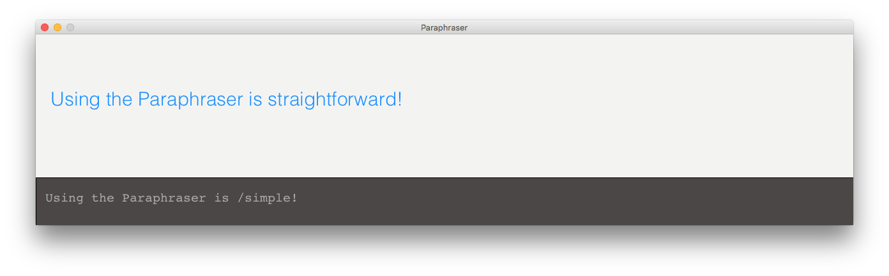

# Paraphraser

### A speech and language tool by [Mitchell Griest](mailto:mdgriest@crimson.ua.edu)

## Purpose

I created the paraphraser to help my mother's speech and language students understand paraphrasing and expand their vocabularies. While it is a bit naive in its replacement strategy, there are still many cases where it can help, and that is something to be excited about!

# Using the Paraphraser

Getting started is easy. Simply start typing! Your input will appear along the bottom, while the paraphrased output will populate the top of the screen. **Start the words that you would like paraphrased with `/`**, and they will be automatically replaced in the output.

Here is an example:

### Clearing the display

If you would like to clear the display and start over at any time, simply **drag the mouse quickly from right to left**. You can also type any of the following special words to start over:

* `.clear`
* `.reset`
* `.c`
* `.r`

These will also work in all CAPS!

# How it works

The Paraphraser reads your input one word at a time. When you start a word with `/`, the program asks [Thesaurus.com](http://www.thesaurus.com/) for the most relevant synonym for that word, and replaces it in the output. If there isn't a synonym for the word you entered, the Paraphraser will simply leave it alone.

# Known Issues

While it is great for simple substitutions and finding a more interesting way of saying things, the Paraphraser is ultimately naive in its replacement strategy. In order to make smarter swaps, the program would need to understand a few additional things, like tense, plurality, and the context in which the word is being used.

# Have fun!

I hope that you find the Paraphraser useful and would love to hear about the various ways you are putting it to use. If you have stories, feedback, or ideas for future features and improvements, please email me at [mdgriest@crimson.ua.edu](mailto:mdgriest@crimson.ua.edu).

Please also feel free to have a look at some of my other projects. Most recently, a [clock](https://github.com/mdgriest/Word-Clock) and a [stopwatch](https://github.com/mdgriest/Word-Stopwatch) that represent time using words in a simple, clean interface.

All of these projects are free and open-source.

Very best,

Mitchell Griest
